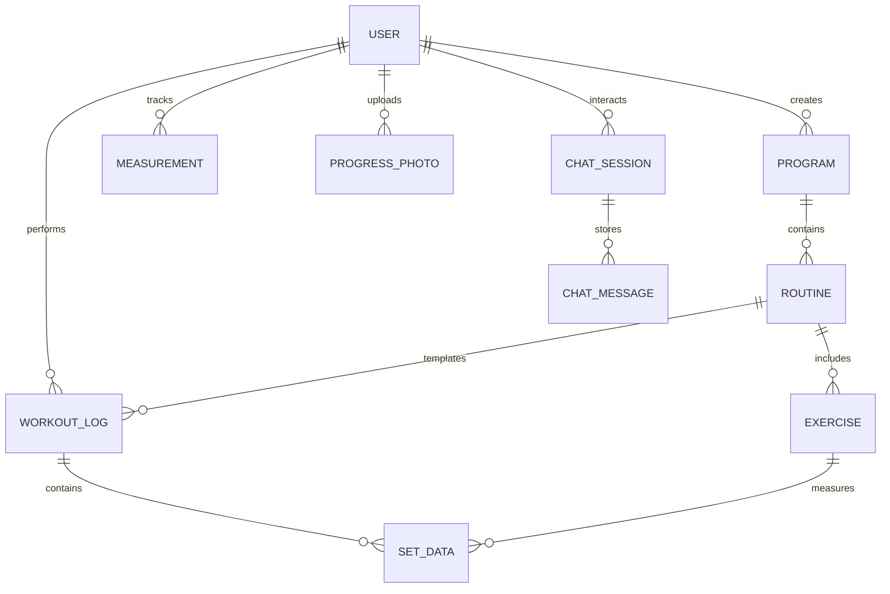

<div align="center">

# 🏋️ Musclo
### **The Intelligent Workout Journal & AI Personal Trainer**

[](https://opensource.org/licenses/ISC)
[](https://react.dev/)
[](https://nodejs.org/)
[](https://www.mysql.com/)
[](https://tailwindcss.com/)
[](https://azure.microsoft.com/)

**Musclo** is a state-of-the-art, full-stack **Workout Journal** and **AI Personal Trainer** engineered for high-performance strength training. It transcends traditional logging by integrating **Intelligent Performance Auditing**, **Dynamic Volume Analytics**, and a **Gamified Progression Engine** to transform raw workout data into a strategic roadmap for physical excellence.

[**Explore the Code**](https://github.com/hubonii/musclo_online.git) • [**Report Bug**](https://github.com/hubonii/musclo_online/issues) • [**Request Feature**](https://github.com/hubonii/musclo_online/issues)

---

</div>

## 📖 Table of Contents
- [🔍 Project Overview](#-project-overview)
- [✨ Core Capabilities](#-core-capabilities)
- [🏗️ Technical Architecture](#️-technical-architecture)
- [📊 Database Schema](#-database-schema)
- [🛡️ Security & Integrity](#️-security--integrity)
- [⚡ Performance Engineering](#-performance-engineering)
- [🧠 Intelligent Coaching Logic](#-intelligent-coaching-logic)
- [📂 Engineering Blueprint](#-engineering-blueprint)
- [🧪 Testing Strategy](#-testing-strategy)
- [⚙️ Local Synchronization](#️-local-synchronization)
- [🎮 Gamification Mechanics](#-gamification-mechanics)
- [🎓 Graduation Project Governance](#-graduation-project-governance)

---

## 🔍 Project Overview
**Musclo** addresses the critical "Information Gap" in strength training—the void between recording a set and understanding its long-term impact. This platform leverages a **relational core** to maintain strict data integrity while providing a **Fluid React UI** for seamless logging. The system synthesizes lifetime volume, exercise variety, and frequency into a personalized **Intelligent Context**, offering users insights previously reserved for professional athletes.

---

## ✨ Core Capabilities

### 🧠 Intelligent Coaching System
*   **Contextual Auditing**: Real-time analysis of workout history to suggest intensity adjustments.
*   **Adaptive Memory**: Long-term session summarization (Latent Memory) that maintains your personal training narrative.
*   **Smart Program Generation**: Dynamic creation of routines based on equipment availability and muscle priority.

### 📊 Advanced Data Analytics
*   **Progression Mapping**: 1RM (One Rep Max) estimation trends using the Brzycki formula.
*   **Anatomical Heatmaps**: Volume distribution tracking across major/minor muscle groups.
*   **Consistency Visualization**: Interactive calendar heatmaps for long-term adherence tracking.

### 📋 Professional Workflow
*   **Multi-Type Sets**: Support for Warm-up, Working, To-Failure, and AMRAP set configurations.
*   **Live Tracking**: Real-time rest timers and previous-set history overlays during active workouts.
*   **Media Integration**: Secure photo storage for visual transformation tracking via Azure Blob Storage.

---

## 🏗️ Technical Architecture

### **The Stack**

| Layer | Technology | Rationale |
| :--- | :--- | :--- |
| **Frontend** | `React 19` + `Vite` | Optimized rendering cycles and ultra-fast HMR. |
| **State** | `Zustand` | Lightweight, performant state management for complex workout flows. |
| **Data Fetching** | `TanStack Query` | Advanced caching and background synchronization. |
| **Backend** | `Node.js` + `Express` | Event-driven architecture for high-concurrency requests. |
| **ORM** | `Sequelize` | Relational integrity with advanced model associations. |
| **Database** | `MySQL` | High-performance relational storage for structured fitness data. |

---

## 📊 Database Schema

The system utilizes a highly normalized relational schema to ensure 100% data integrity across complex workout structures.



---

## 🛡️ Security & Integrity
*   **Identity Management**: Industrial-grade JWT (JSON Web Token) authentication with secure cookie storage.
*   **Request Hardening**: `Helmet.js` implementation for HTTP header security and `CORS` protection.
*   **Data Protection**: `Bcrypt.js` hashing for sensitive user information.
*   **Concurrency Control**: Sequelize-managed transactions for critical data operations (e.g., unlocking achievements).

---

## ⚡ Performance Engineering
*   **Frontend Caching**: TanStack Query reduces redundant API calls by up to 80% via aggressive stale-while-revalidate strategies.
*   **Backend Efficiency**: Optimized Sequelize queries with strategic `include` indexing and attribute filtering.
*   **Static Asset Optimization**: Vite-powered code splitting and tree-shaking for minimal initial bundle size.
*   **Media Streaming**: Direct SAS-token integration with Azure for secure, low-latency image delivery.

---

## 🧠 Intelligent Coaching Logic
The "Intelligent" component of Musclo isn't just a gimmick; it's a multi-layered logic system:
1.  **Latent Memory**: The system periodically consolidates chat history into high-level summaries (`latent_memory`), allowing the coach to remember your goals across weeks.
2.  **Performance Auditing**: When you ask a question, the system injects your recent volume, PRs, and current workout status into the context.
3.  **Invisible Intelligence**: The coach uses your history as background intelligence, providing advice that "knows" you've been skipping leg day without you having to mention it.

---

## 📂 Engineering Blueprint

```text
musclo-online/
├── 🚀 backend/             # Enterprise Logic
│   ├── config/             # DB & Storage Config
│   ├── controllers/        # Domain-driven logic
│   ├── models/             # Strict relational schema
│   ├── services/           # External abstractions (AI, Azure)
│   └── test/               # Unit & Integration coverage
├── 🎨 frontend/            # High-Performance UI
│   ├── components/         # Atomic UI modules
│   ├── hooks/              # Custom React logic
│   ├── store/              # Global state (Zustand)
│   └── test/               # E2E (Playwright) & Unit
└── README.md
```

---

## 🧪 Testing Strategy
We adhere to the **Testing Pyramid** to ensure zero-regression development:

### **Backend Testing**
- **Unit Tests**: Logic validation for services and utilities.
  ```bash
  cd backend
  npm run test:unit
  ```
- **Integration Tests**: API endpoint validation with `Supertest`.
  ```bash
  cd backend
  npm run test:integration
  ```
- **Coverage Reports**:
  ```bash
  cd backend
  npm run test:coverage
  ```

### **Frontend Testing**
- **Component & Unit Tests**:
  ```bash
  cd frontend
  npm run test:unit
  ```
- **End-to-End (E2E)**: Complete user journey validation using `Playwright`.
  ```bash
  cd frontend
  npm run test:e2e
  ```
- **Coverage Reports**:
  ```bash
  cd frontend
  npm run test:coverage
  ```

---

## ⚙️ Local Synchronization

### 1. Repository Acquisition
```bash
git clone https://github.com/hubonii/musclo_online.git
cd musclo_online
```

### 2. Backend Provisioning
```bash
cd backend
npm install
cp .env.example .env
# Configure DB_PASSWORD & AI_ENGINE_KEY
npx sequelize-cli db:migrate
npx sequelize-cli db:seed:all
npm run dev
```

### 3. Frontend Initialization
```bash
cd ../frontend
npm install
cp .env.example .env
npm run dev
```

---

## 🎮 Gamification Mechanics
*   **Ranking System**: Real-time rank calculation (Novice -> Elite) based on lifetime volume.
*   **Streak Logic**: Sophisticated algorithm in `achievementService.js` that tracks consistency with automated resets.
*   **Variety Milestones**: Achievements unlocked specifically for training diversity and PR consistency.

---

## 🎓 Graduation Project Governance
**University**: Arab Open University (AOU)  
**Academic Year**: 2025/2026

### **Primary Developer**
- **Mohamed Saad Hussien** 
  - *Lead Systems Architect & Full-Stack Developer*
  - [GitHub](https://github.com/hubonii)

### **Academic Supervision**
- **Prof. Eid Amry**
  - *Project Supervisor*

---

<div align="center">
  <b>Musclo — Engineering the Future of Human Performance.</b>
</div>
